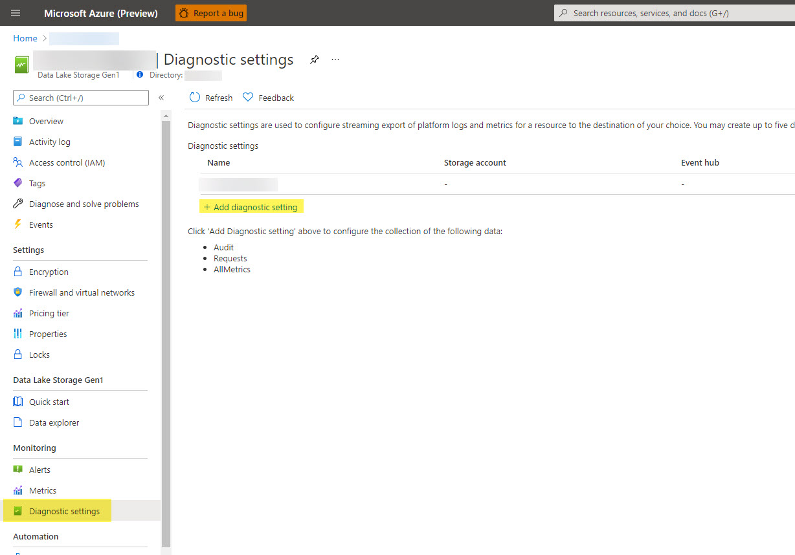
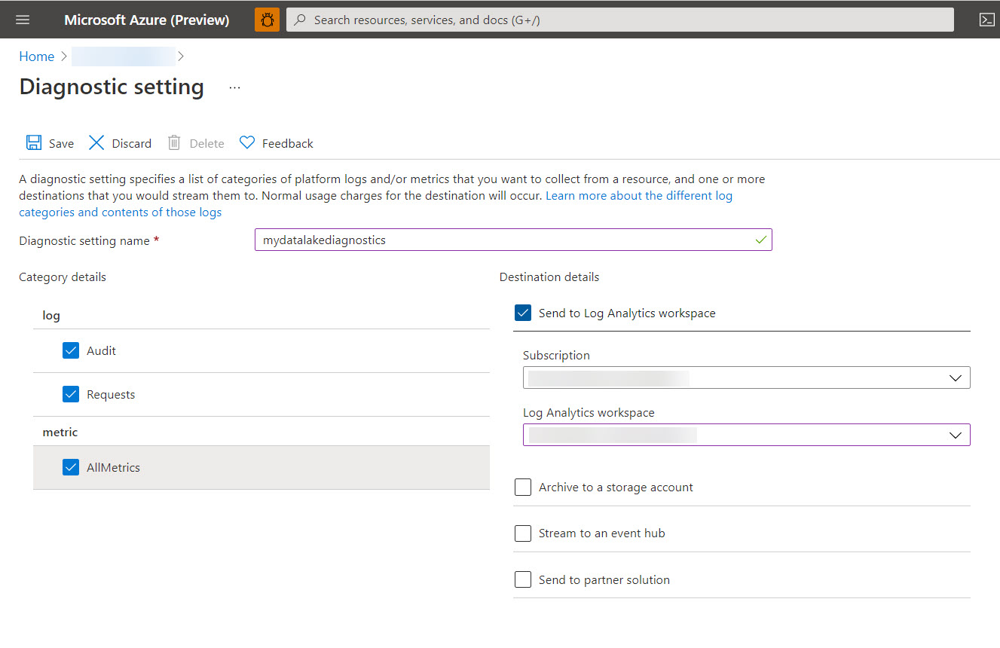

When it comes to migrations, often, it is not the migration itself that is the challenge. The real work begins in understanding ingestion vs. consumption of the data. Without proper monitoring in place you won't be able to tell who or what is consuming the data? In a large enterprise deployment, the data analytics team may or may not be aware of all the different endpoints that are utilized to load data into the storage account. By configuring your Data Lake Gen 1 account data to send telemetry to Log Analytics, this becomes a straightforward exercise.

# Telemetry
Telemetry is an extremely important part of any solution, and is no less important at the storage layer in a cloud implementation than any other layer of the stack. Azure Log Analytics is an important part of your this solution. For some background on Log Analytics, start [here](https://docs.microsoft.com/en-us/azure/azure-monitor/logs/log-analytics-overview). 

## Configuring the Data Lake Gen 1 account to send data to Log Analytics
If you already have log analytics configured for your data lake gen1 account, skip to the next section. Otherwise, read on to learn how to configure data lake gen1 to send telemetry to Log Analytics. 

Open your data lake gen1 account in the Azure portal, and go to the diagnostics settings in the control blade on the left hand side:



Select "+ Add Diagnostic setting" in the resulting screen and check the boxes for the telemetry you wish to gather. Then check "Send to Log Analytics workspace" and select the name of the log analytics you wish to send the telemetry too. For cost and latency purposes, it is recommended to select a Log Analytics workspace in the same region as your data lake gen1 account. 



## Log Analytics queries
Once you have configured your data lake to send telemetry to Log Analytics, the next step is to gather some analysis on who and what is accessing your system. It's now possible to answer a variety of questions, such as 
What blobs were accessed?
* What is being written and what containers are heavily accessed?
* What containers are heavily read from?
* How long do operations against the account take?
* Am I being throttled due to high volume usage? 

### Number of Calls By Container and HTTP Type
The below query can be used to see the number of calls and http method against specific containers in your environment. For example, this would show you which containers are most heavily used. 

````
AzureDiagnostics
| where ResourceProvider == "MICROSOFT.DATALAKESTORE" and TimeGenerated >= ago(3d)
//request logs capture every API request made on the Data Lake Storage Gen1 account
| where Category == "Requests"
| project Resource, ResourceGroup, ResourceType, OperationName, ResultType, CorrelationId, HttpMethod_s, Path_s, identity_s, UserId_g, StoreEgressSize_d, StoreIngressSize_d, CallerIPAddress, StartTime_t, EndTime_t, RequestDuration = datetime_diff("Millisecond", EndTime_t, StartTime_t)
| extend Path = split(Path_s, '/')
| mv-expand root = Path[0], level1 = Path[1], level2 = Path[2], level3 = Path[3], level4 = Path[4], level5 = Path[5], level6 = Path[6], level7 = Path[7], level8 = Path[8], level9 = Path[9]
| summarize count() by tostring(level3), HttpMethod_s 
````

### Number of Operations By Identity
This query can be used to see the number of Operations by the identity of the caller and what types of request are being issued.

````
AzureDiagnostics
| where ResourceProvider == "MICROSOFT.DATALAKESTORE" and TimeGenerated >= ago(3d)
| where Category == "Requests"
| project identity_s, CorrelationId, HttpMethod_s
| summarize count() by identity_s, HttpMethod_s
````

### Throttling
This query can be used to see the requests that were throttled over the given timespan. It returns a tabular result:

````
AzureDiagnostics
| where ResourceProvider == "MICROSOFT.DATALAKESTORE" and TimeGenerated >= ago(3d)
| where Category == "Requests"
//am I being throttled? Have I submitted too many requests within a given timeframe?
| where ResultType == 429
| project Resource, ResourceGroup, ResourceType, OperationName, ResultType, CorrelationId, HttpMethod_s, Path_s, identity_s, UserId_g, StoreEgressSize_d, StoreIngressSize_d, CallerIPAddress, StartTime_t, EndTime_t
````

# Inventory 
In addition to gathering the telemetry of what's currently being accessed, you should also be aware of the overall inventory of your environment. 

Here we've included a helpful PowerShell script to run against your environment. See here for more information: [Ageing Analysis Guide: A quick start template](https://github.com/Azure/adlsgen1togen2migration/tree/main/3-Migrate/Utilities/Ageing%20Analysis)

