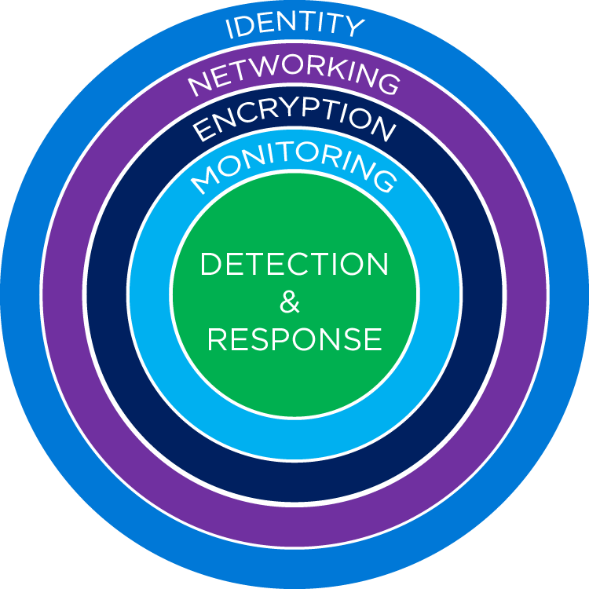

## Secure Your Storage Accounts

The objective of this section is to provide individuals with a playbook that will guide them in illustrating the principals, configurations and technical controls that will protect and secure their Azure Storage Account subsystem.

### Why This is Important
One of the primary concerns customers will have is how do I properly secure my Azure Storage Accounts and the data within.
In typical architectures, Azure Blob Storage and Azure Data Lake Storage (ADLS Gen1 and ADLS Gen2) are the foundational building blocks and are treated as the scalable and flexible storage fabric for applications and data lakes. In addition, multiple compute engines from different providers interact with Blob Storage and/or ADLS Gen2 to enable their workloads.
These include, but are not limited to, Azure Functions, Databricks, Web Apps, Virtual Machine Disks, HDInsight, Machine Learning, Containers and several other flavors of both open source and proprietary data processing frameworks interact in one way or another with an Azure Storage Account.

Because of this, it is important to ensure the proper security settings are applied to Storage Accounts to protect the underlying data. It is crucial to dedicate the time and energy necessary to understand what individuals should be thinking and configuring to make certain their Storage Accounts (Blob and ADLS Gen2) are hardened and well protected.

---
---
### Objectives

Map the security capabilities of Azure Storage to recommended [security practices](https://docs.microsoft.com/en-us/azure/architecture/framework/security/overview) for:
* Identity
* Networking
* Encryption
* Auditing & Monitoring
* Detection & Response
* [Click here for an overview of the above security pillars](https://docs.microsoft.com/en-us/azure/architecture/framework/security/overview)

#### Where Do I Start?
So the question you may be asking yourself is where do I start? One of the best approaches is to start with a layered approach. Start from the outside (**Identity**) and work your way in until you get to **Detection & Monitoring**. This method gives you a linear path for understanding the concepts, and for visual learners it can paint a cleaner picture of how the security principals are applied to a Storage Account.

 

---
---

### Agenda

* Introduction
* Step 1 - Identity
* Step 2 - Networking
* Step 3 - Encryption
* Step 4 - Data Protection
* Step 5 - Auditing & Monitoring
* Step 6 - Detection & Response
---
---
### Introduction 

**[What is Azure Storage?](https://docs.microsoft.com/en-us/azure/storage/blobs/storage-blobs-overview)**

Azure Blob storage is Microsoft's object storage solution for the cloud. Blob storage is optimized for storing massive amounts of unstructured data. Unstructured data is data that doesn't adhere to a particular data model or definition, such as text or binary data.

Microsoft Azure Storage is a managed service that provides durable, secure, and scalable storage in the cloud. Let's break these terms down.

<table>
  <tr>
    <td valign="top"><b>Durable</b></td>
    <td>Redundancy ensures that your data is safe in the event of transient hardware failures. You can also replicate data across datacenters or geographical regions for extra protection from local catastrophe or natural disaster. Data replicated in this way remains highly available in the event of an unexpected outage.</td>
  </tr>
  <tr>
    <td valign="top"><b>Secure</b></td>
    <td>All data written to Azure Storage is encrypted by the service. Azure Storage provides you with fine-grained control over who has access to your data.</td>
  </tr>
  <tr>
    <td valign="top"><b>Scalable</b></td>
    <td>Azure Storage is designed to be massively scalable to meet the data storage and performance needs of today's applications.</td>
  </tr>
  <tr>
    <td valign="top"><b>Managed</b></td>
    <td>Microsoft Azure handles maintenance and any critical problems for you.</td>
  </tr>
</table>
  

**Azure Data Services**

Azure storage includes four types of data:

* **Blobs:** A massively scalable object store for text and binary data. Can include support for Azure Data Lake Storage Gen2.
* **Files:** Managed file shares for cloud or on-premises deployments.
* **Queues:** A messaging store for reliable messaging between application components.
* **Table Storage:** A NoSQL store for schema-less storage of structured data. Table Storage is not covered in this module.

All of these data types in Azure Storage are accessible from anywhere in the world over HTTP or HTTPS. Microsoft provides SDKs for Azure Storage in various languages, and a REST API. You can also visually explore your data right in the Azure portal.

**Blob Storage**

Azure Blob storage is an object storage solution optimized for storing massive amounts of unstructured data, such as text or binary data. Blob storage is ideal for:

* Serving images or documents directly to a browser, including full static websites.
* Storing files for distributed access.
* Streaming video and audio.
* Storing data for backup and restoration, disaster recovery, and archiving.
* Storing data for analysis by an on-premises or Azure-hosted service.

Azure Storage supports three kinds of blobs:

| Blob Type | Description|
|-----------|------------|
|**Block Blobs** | Block blobs are used to hold text or binary files up to ~5 TB (50,000 blocks of 100 MB) in size. The primary use case for block blobs is the storage of files that are read from beginning to end, such as media files or image files for websites. They are named block blobs because files larger than 100 MB must be uploaded as small blocks. These blocks are then consolidated (or committed) into the final blob. |
|**Page Blobs**  | Page blobs are used to hold random-access files up to 8 TB in size. Page blobs are used primarily as the backing storage for the VHDs used to provide durable disks for Azure Virtual Machines (Azure VMs). They are named page blobs because they provide random read/write access to 512-byte pages. |
|**Append Blobs**| Append blobs are made up of blocks like block blobs, but they are optimized for append operations. These blobs are frequently used for logging information from one or more sources into the same blob. For example, you might write all of your trace logging to the same append blob for an application running on multiple VMs. A single append blob can be up to 195 GB.|

**Files**

Azure Files enables you to set up highly available network file shares that can be accessed using the standard Server Message Block (SMB) protocol. This means that multiple VMs can share the same files with both read and write access. You can also read the files using the REST interface or the storage client libraries. You can also associate a unique URL to any file to allow fine-grained access to a private file for a set period of time. File shares can be used for many common scenarios:

* Storing shared configuration files for VMs, tools, or utilities so that everyone is using the same version.
* Log files such as diagnostics, metrics, and crash dumps.
* Shared data between on-premises applications and Azure VMs to allow migration of apps to the cloud over a period of time.

**Queues**

The Azure Queue service is used to store and retrieve messages. Queue messages can be up to 64 KB in size, and a queue can contain millions of messages. Queues are used to store lists of messages to be processed asynchronously.

You can use queues to loosely connect different parts of your application together. For example, we could perform image processing on the photos uploaded by our users. Perhaps we want to provide some sort of face detection or tagging capability, so people can search through all the images they have stored in our service. We could use queues to pass messages to our image-processing service to let it know that new images have been uploaded and are ready for processing. This sort of architecture would allow you to develop and update each part of the service independently.

**Azure Storage Accounts**

To access any of these services from an application, you have to create a storage account. The storage account provides a unique namespace in Azure to store and access your data objects. A storage account contains any blobs, files, queues, tables, and VM disks that you create under that account.

**Create a Storage Account**

You can create an Azure storage account using the Azure portal, Azure PowerShell, or Azure CLI. Azure Storage provides three distinct account options with different pricing and features supported.

| Account Type | Description|
|--------------|------------|
|**General-purpose v2 (GPv2)**|General-purpose v2 (GPv2) accounts are storage accounts that support all of the latest features for blobs, files, queues, and tables. Pricing for GPv2 accounts has been designed to deliver the lowest per gigabyte prices.|
|**General-purpose v1 (GPv1)**|General-purpose v1 (GPv1) accounts provide access to all Azure Storage services but may not have the latest features or the lowest per gigabyte pricing. For example, cool storage and archive storage are not supported in GPv1. Pricing is lower for GPv1 transactions, so workloads with high churn or high read rates may benefit from this account type.|
|**Blob Storage Accounts**|A legacy account type, blob storage accounts support all the same block blob features as GPv2, but they are limited to supporting only block and append blobs. Pricing is broadly similar to pricing for general-purpose v2 accounts.|

 

### Security Context

Azure Storage accounts provide a wealth of security options that protect your cloud-based data. Azure services such as Blob storage, Files share, Table storage, and Data Lake Store all build on Azure Storage. Because of this foundation, the services benefit from the fine-grained security controls in Azure Storage.

Azure Storage security options will allow them to:
* Protect the data at rest
* Protect the data in transit
* Support browser cross-domain access
* Control who can access data
* Audit storage access

**References:**

* [Store data in Azure](https://docs.microsoft.com/en-us/learn/paths/store-data-in-azure/)
* [Introduction to the core Azure Storage services](https://docs.microsoft.com/en-us/azure/storage/common/storage-introduction)
* [Introduction to Azure Blob storage](https://docs.microsoft.com/en-us/azure/storage/blobs/storage-blobs-introduction)
* [Introduction to Azure Data Lake Storage Gen2](https://docs.microsoft.com/en-us/azure/storage/blobs/data-lake-storage-introduction)
* [Gen1 vs Gen2 capabilities](https://docs.microsoft.com/en-us/azure/storage/blobs/data-lake-storage-migrate-gen1-to-gen2)
* [Best practices for using Azure Data Lake Storage Gen2](https://docs.microsoft.com/en-us/azure/storage/blobs/data-lake-storage-best-practices)

---
---
### Step 1 - IDENTITY

Each time you access data in your storage account, your client makes a request over HTTP/HTTPS to Azure Storage. Every request to a secure resource must be authorized, so that the service ensures that the client has the permissions required to access the data. You can choose from several access options. Arguably, the most flexible option is role-based access.

Azure Storage supports Azure Active Directory and role-based access control (RBAC) for both resource management and data operations. For security principals, you can assign RBAC roles that are scoped to the storage account. Use Active Directory to authorize resource management operations, such as configuration. Active Directory is supported for data operations on Blob and Queue storage.

To a security principal or a managed identity for Azure resources, you can assign RBAC roles that are scoped to a subscription, a resource group, a storage account, or an individual container or queue.

---
**Azure Data Lake Storage security**

Azure Data Lake Storage Gen2 provides a first-class data lake solution that enables enterprises to consolidate their data. It's built on Azure Blob storage, so it inherits all of the security features we've reviewed in this module.

Along with role-based access control (RBAC), Azure Data Lake Storage Gen2 provides access control lists (ACLs) that are POSIX-compliant, and that restrict access to only authorized users, groups, or service principals. It applies restrictions in a way that's flexible, fine-grained, and manageable. Azure Data Lake Storage Gen2 authenticates through Azure Active Directory OAuth 2.0 bearer tokens. This allows for flexible authentication schemes, including federation with Azure AD Connect and multifactor authentication that provides stronger protection than just passwords.

More significantly, these authentication schemes are integrated into the main analytics services that use the data. These services include Azure Databricks, HDInsight, and Azure Synapse Analytics. Management tools, such as Azure Storage Explorer, are also included. After authentication finishes, permissions are applied at the finest granularity to ensure the right level of authorization for an enterprise's big-data assets.

---
Azure Storage offers options for authenticating and authorizing access to resources:
* Shared Key authorization
* Shared access signature (SAS) authorization
* Role-based access control (Azure RBAC)
* [Access control lists (ACL)](https://docs.microsoft.com/en-us/azure/storage/blobs/data-lake-storage-acl-azure-portal)
* [Attribute-based access control (Azure ABAC)](https://docs.microsoft.com/en-us/azure/role-based-access-control/conditions-overview)
* [Authentication and Authorization Options for accessing data in Azure Storage](https://docs.microsoft.com/en-us/azure/storage/common/authorize-data-access)

[Authorization mechanisms and access control model](https://docs.microsoft.com/en-us/azure/storage/blobs/data-lake-storage-access-control-model) that Data Lake Storage Gen2 supports:
* Shared Key authorization
* Shared access signature (SAS) authorization
* Role-based access control (Azure RBAC)
* Access control lists (ACL)
* Attribute-based access control (Azure ABAC)

**Recommended practices for Identity**

* [Security recommendations for Blob storage](https://docs.microsoft.com/en-us/azure/storage/blobs/security-recommendations)
* [Best practices when using SAS](https://docs.microsoft.com/en-us/azure/storage/common/storage-sas-overview)
* Secure your account access keys with Azure Key Vault
* Regenerate your account keys periodically
* Keep in mind the principal of least privilege when assigning permissions to a SAS

> [!NOTE]
> Microsoft recommends that you use Azure AD credentials when possible as a security best practice, rather than using the account key and sas signitures, which can be more easily compromised. When your application design requires shared access signatures for access to Blob storage, use Azure AD credentials to create a user delegation SAS when possible for superior security. For more information, see [Authorize access to data in Azure Storage](https://docs.microsoft.com/en-us/azure/storage/common/authorize-data-access).

> [!NOTE]
> It is a best practice, and recommended, to create a security group in Azure AD and maintain permissions on the group rather than individual users. For details on this recommendation, as well as other best practices, see [Access control model in Azure Data Lake Storage Gen2](https://docs.microsoft.com/en-us/azure/storage/blobs/data-lake-storage-access-control-model).

**References:**

* [Shared Key Authorization](https://docs.microsoft.com/en-us/rest/api/storageservices/authorize-with-shared-key)
* [Manage storage account access keys](https://docs.microsoft.com/en-us/azure/storage/common/storage-account-keys-manage?tabs=azure-portal)
* [Shared Access Signature (SAS) authorization](https://docs.microsoft.com/en-us/rest/api/storageservices/delegate-access-with-shared-access-signature)
* [Access control lists (ACLs) in Azure Data Lake Storage Gen2](https://docs.microsoft.com/en-us/azure/storage/blobs/data-lake-storage-access-control)
* [What is Azure attribute-based access control (Azure ABAC)?](https://docs.microsoft.com/en-us/azure/role-based-access-control/conditions-overview)
---
---

### Step 3 - Networking

Network isolation is an important component of ensuring a secure Storage Account. By default, storage accounts accept connections from clients on any network. To control and limit the level of access to selected networks, you must first change the default action. You can restrict access to specific IP addresses, ranges, or virtual networks.

Azure Storage provides several options for controling network access to your storage accounts:
* [Require secure transfer](https://docs.microsoft.com/en-us/azure/storage/common/storage-require-secure-transfer)
* [Enforce a minimum required version of Transport Layer Security (TLS)](https://docs.microsoft.com/en-us/azure/storage/common/transport-layer-security-configure-minimum-version)
* [Firewall rules](https://docs.microsoft.com/en-us/azure/storage/common/storage-network-security)
* [Service Endpoints](https://docs.microsoft.com/en-us/azure/virtual-network/virtual-network-service-endpoints-overview)
* [Private Link/Private Endpoints](https://docs.microsoft.com/en-us/azure/storage/common/storage-private-endpoints)
* [Network Routing](https://docs.microsoft.com/en-us/azure/storage/common/network-routing-preference)
* [Cross-Origin Resource Sharing (CORS)](https://docs.microsoft.com/en-us/rest/api/storageservices/cross-origin-resource-sharing--cors--support-for-the-azure-storage-services)

#### Require Secure Transfer 
You can configure your storage account to accept requests from secure connections only by setting the Secure transfer required property for the storage account. When you require secure transfer, any requests originating from an insecure connection are rejected. Microsoft recommends that you always require secure transfer for all of your storage accounts.

#### Enforce a minimum required version of Transport Layer Security (TLS)
Communication between a client application and an Azure Storage account is encrypted using Transport Layer Security (TLS). TLS is a standard cryptographic protocol that ensures privacy and data integrity between clients and services over the Internet. For more information about TLS, see Transport Layer Security.

Azure Storage currently supports three versions of the TLS protocol: 1.0, 1.1, and 1.2. Azure Storage uses TLS 1.2 on public HTTPS endpoints, but TLS 1.0 and TLS 1.1 are still supported for backward compatibility.

Azure Storage accounts permit clients to send and receive data with the oldest version of TLS, TLS 1.0, and above. **To enforce stricter security measures, you can configure your storage account to require that clients send and receive data with a newer version of TLS.** If a storage account requires a minimum version of TLS, then any requests made with an older version will fail.

#### Firewall Rules
Configure firewall rules to limit access to your storage account to requests that originate from specified IP addresses or ranges, or from a list of subnets in an Azure Virtual Network (VNet). 

Turning on firewall rules for your storage account blocks incoming requests for data by default, unless the requests originate from a service operating within an Azure Virtual Network (VNet) or from allowed public IP addresses. Requests that are blocked include those from other Azure services, from the Azure portal, from logging and metrics services, and so on. You can permit requests from other Azure services by adding an exception to allow trusted Microsoft services to access the storage account.

> [!IMPORTANT]
> Changing network rules can affect your application's ability to connect to Azure Storage. If you set the default network rule to _deny_, you'll block all access to the data unless specific network rules _grant_ access. Before you change the default rule to deny access, be sure to use network rules to grant access to any allowed networks..

#### Service Endpoints
Virtual network [service endpoints]() allow you to secure Azure Storage accounts to your virtual networks, fully removing public internet access to these resources. Service endpoints provide optimal routing by always keeping traffic destined to Azure Storage on the Azure backbone network. This optimal route overrides any routes directing traffic through on-premises or virtual appliances.

#### Private Link/Private Endpoints 
Azure Private Link enables you to access Azure PaaS Services (for example, Azure Storage and SQL Database) and Azure hosted customer-owned/partner services over a [private endpoint](https://docs.microsoft.com/en-us/azure/private-link/private-endpoint-overview) in your virtual network.

You can use private endpoints for your Azure Storage accounts to allow clients on a virtual network (VNet) to securely access data over a Private Link. The private endpoint uses an IP address from the VNet address space for your storage account service. Network traffic between the clients on the VNet and the storage account traverses over the VNet and a private link on the Microsoft backbone network, eliminating exposure from the public internet.

#### Network Routing
You can configure network routing preference for your Azure storage account to specify how network traffic is routed to your account from clients over the Internet using the Microsoft global network or Internet routing

#### Cross-Origin Resource Sharing (CORS) 
CORS is an HTTP feature that enables a web application running under one domain to access resources in another domain. Web browsers implement a security restriction known as same-origin policy that prevents a web page from calling APIs in a different domain. CORS provides a secure way to allow one domain (the origin domain) to call APIs in another domain.

You can set CORS rules individually for each of the storage services (i.e. blob, file, queue, table). Once you set the CORS rules for the service, then a properly authenticated request made against the service from a different domain will be evaluated to determine whether it is allowed according to the rules you have specified.

**Recommended practices for Networking:**

* Configure the minimum required version of Transport Layer Security (TLS) for a storage account.
* Enable the Secure transfer required option on all of your storage accounts
* Enable firewall rules
* Limit network access to specific networks

**References:**

* [Networking recommendations for Blob storage](https://docs.microsoft.com/en-us/azure/storage/blobs/security-recommendations)
* [What is Azure Private Link?](https://docs.microsoft.com/en-us/azure/private-link/private-link-overview)
* [What is Azure Private Endpoint?](https://docs.microsoft.com/en-us/azure/private-link/private-endpoint-overview)
* [Connect to a storage account using an Azure Private Endpoint](https://docs.microsoft.com/en-us/azure/private-link/tutorial-private-endpoint-storage-portal)
---
---

### Step 3 - Encryption

The Azure Storage end-to-end encryption of data and transport layer protections complete the security shield for an enterprise data lake. The same set of analytics engines and tools can take advantage of these additional layers of protection, resulting in complete protection of your analytics pipelines.

#### Encryption at rest
All data written (every block blob, append blob, or page blob) to Azure Storage is automatically encrypted by Storage Service Encryption (SSE) with a 256-bit Advanced Encryption Standard (AES) cipher, and is FIPS 140-2 compliant. SSE automatically encrypts data when writing it to Azure Storage. When you read data from Azure Storage, Azure Storage decrypts the data before returning it. This process incurs no additional charges and doesn't degrade performance. It can't be disabled.

For virtual machines (VMs), Azure lets you encrypt virtual hard disks (VHDs) by using Azure Disk Encryption. This encryption uses BitLocker for Windows images, and it uses dm-crypt for Linux.

Azure Key Vault stores the keys automatically to help you control and manage the disk-encryption keys and secrets. So even if someone gets access to the VHD image and downloads it, they can't access the data on the VHD.

Data in your storage account is automatically encrypted by Azure Storage. Azure Storage encryption offers two options for managing encryption keys at the level of the storage account:

* Microsoft-managed keys. By default, Microsoft manages the keys used to encrypt your storage account.
* Customer-managed keys. You can optionally choose to manage encryption keys for your storage account. Customer-managed keys must be stored in Azure Key Vault.

#### Encryption in transit
Keep your data secure by enabling transport-level security between Azure and the client. Always use HTTPS to secure communication over the public internet. When you call the REST APIs to access objects in storage accounts, you can enforce the use of HTTPS by requiring [secure transfer](https://docs.microsoft.com/en-us/azure/storage/storage-require-secure-transfer) for the storage account. After you enable secure transfer, connections that use HTTP will be refused. This flag will also enforce secure transfer over SMB by requiring SMB 3.0 for all file share mounts.

**Recommended practices for Encryption:**

* Require secure transfer (HTTPS) to the storage account

**References:**

* [Azure Storage encryption for data at rest](https://docs.microsoft.com/en-us/azure/storage/common/storage-service-encryption)
* [Enable infrastructure encryption for double encryption of data](https://docs.microsoft.com/en-us/azure/storage/common/infrastructure-encryption-enable?tabs=portal)
* [Check the encryption status of a blob](https://docs.microsoft.com/en-us/azure/storage/blobs/storage-blob-encryption-statu)

---
---

### Step 4 - Data Protection

Azure Storage provides data protection for Blob Storage and Azure Data Lake Storage Gen2 to help you to prepare for scenarios where you need to recover data that has been deleted or overwritten. It's important to think about how to best protect your data before an incident occurs that could compromise it. 

Azure Storage provides several data protection options for protecting the storage account and data within it from being deleted or modified, or for restoring data after it has been deleted or modified: 

* **Resource Locks** - Configure an Azure Resource Manager lock on the storage account to protect the account from deletion or configuration changes. [Learn more...](https://docs.microsoft.com/en-us/azure/storage/common/lock-account-resource)
* **Soft Delete for Containers and Blobs** -Enable container soft delete for the storage account to recover a deleted container and its contents. [Learn more...](https://docs.microsoft.com/en-us/azure/storage/blobs/soft-delete-container-enable)
* **Versioning & Snapshots** - Save the state of a blob at regular intervals:
  * For Blob Storage workloads, enable blob versioning to automatically save the state of your data each time a blob is overwritten. [Learn more...](https://docs.microsoft.com/en-us/azure/storage/blobs/versioning-enable)
  * For Azure Data Lake Storage workloads, take manual snapshots to save the state of your data at a particular point in time. [Learn more...](https://docs.microsoft.com/en-us/azure/storage/blobs/snapshots-overview)
* **Point-in-time restore** - Restore a set of block blobs to a previous point in time. [Learn more...](https://docs.microsoft.com/en-us/azure/storage/blobs/point-in-time-restore-overview)
* **Immutable Storage** - Immutable storage for Azure Blob Storage enables users to store business-critical data in a WORM (Write Once, Read Many) state. While in a WORM state, data cannot be modified or deleted for a user-specified interval. By configuring immutability policies for blob data, you can protect your data from overwrites and deletes. [Learn more...](https://docs.microsoft.com/en-us/azure/storage/blobs/immutable-storage-overview)

**Recommended practices for Data Protection:**

* Use the Azure Resource Manager deployment model
* Turn on soft delete for blobs
* Turn on soft delete for containers
* Lock storage account to prevent accidental or malicious deletion or configuration changes
* Store business-critical data in immutable blobs
* Limit shared access signature (SAS) tokens to HTTPS connections only

**References:**

* [Data protection recommendations for Blob storage](https://docs.microsoft.com/en-us/azure/storage/blobs/security-recommendations)
* [Data protection overview](https://docs.microsoft.com/en-us/azure/storage/blobs/data-protection-overview) 
---
---

### Step 4 - Auditing & Monitoring

Azure Storage is a fundamental part of many Azure applications. You can use it to store the critical data required by your applications. It's vital to ensure any problems, performance or security issues with your storage accounts are identified and fixed quickly.

#### Tools available for troubleshooting Azure Storage
Azure Blob Storage creates monitoring data by using [Azure Monitor](https://docs.microsoft.com/en-us/azure/azure-monitor/essentials/monitor-azure-resource), which is a full stack monitoring service in Azure. Azure Monitor provides a complete set of features to monitor your Azure resources and resources in other clouds and on-premises.

**Azure portal**

Azure Storage and Azure monitor give you a graphical way to view and monitor storage performance and security logs in near real time. (Please note, there can be a delay of a few minutes between capturing data and it appearing on the Azure portal.)

Through the Azure portal, you can:

* Configure metrics and logging.
* View graphs and charts, and select which metrics to visualize.
* Assess how your applications are doing over some time.
* Configure alerts to notify you of any behavior that is out of the ordinary.
* You can audit Azure Storage access by using the built-in Storage Analytics service. (**Remember** auditing is another part of controlling access.)
  * An Azure storage account logs every operation in real time, and you can search the Storage Analytics logs for specific requests. Filter based on the authentication mechanism, the success of the operation, or the resource that was accessed.

**Recommended practices for Auditing &  Monitoring:**

* Enable alerts for anomalous activities. Use [Azure Security Center](https://docs.microsoft.com/en-us/azure/security-center/security-center-managing-and-responding-alerts) with Log Analytics Workspace for monitoring and alerting on anomalous activity found in security logs and events.
* Track how requests are authorized
* Set up alerts in Azure Monitor
* Route diagnostic logs for analysis to Log Analytics.

**References:**

* [Monitoring Azure Blob Storage](https://docs.microsoft.com/en-us/azure/storage/blobs/monitor-blob-storage)
* [Log alerts in Azure Monitor](https://docs.microsoft.com/en-us/azure/azure-monitor/alerts/alerts-unified-log)
* [Monitor, diagnose, and troubleshoot your Azure storage](https://docs.microsoft.com/en-us/learn/modules/monitor-diagnose-and-troubleshoot-azure-storage/)

---
---

### Step 5 - Detection & Response

[Azure Defender for Storage](https://docs.microsoft.com/en-us/azure/security-center/defender-for-storage-introduction) provides an extra layer of security intelligence that detects unusual and potentially harmful attempts to access or exploit storage accounts. This layer of protection allows you to address threats without being a security expert or managing security monitoring systems.

Security alerts are triggered when anomalies in activity occur. These security alerts are integrated with Azure Security Center, and are also sent via email to subscription administrators, with details of suspicious activity and recommendations on how to investigate and remediate threats.

#### What are the benefits of Azure Defender for Storage?

Azure Defender for Storage provides:

* **Azure-native security** - With 1-click enablement, Defender for Storage protects data stored in Azure Blob, Azure Files, and Data Lakes. As an Azure-native service, Defender for Storage provides centralized security across all data assets managed by Azure and is integrated with other Azure security services such as Azure Sentinel.
* **Rich detection suite** - Powered by Microsoft Threat Intelligence, the detections in Defender for Storage cover the top storage threats such as anonymous access, compromised credentials, social engineering, privilege abuse, and malicious content.
* **Response at scale** - Security Center's automation tools make it easier to prevent and respond to identified threats. Learn more in Automate responses to Security Center triggers.

 

**References:**

* [Introduction to Azure Defender for Storage](https://docs.microsoft.com/en-us/azure/security-center/defender-for-storage-introduction)

---
---